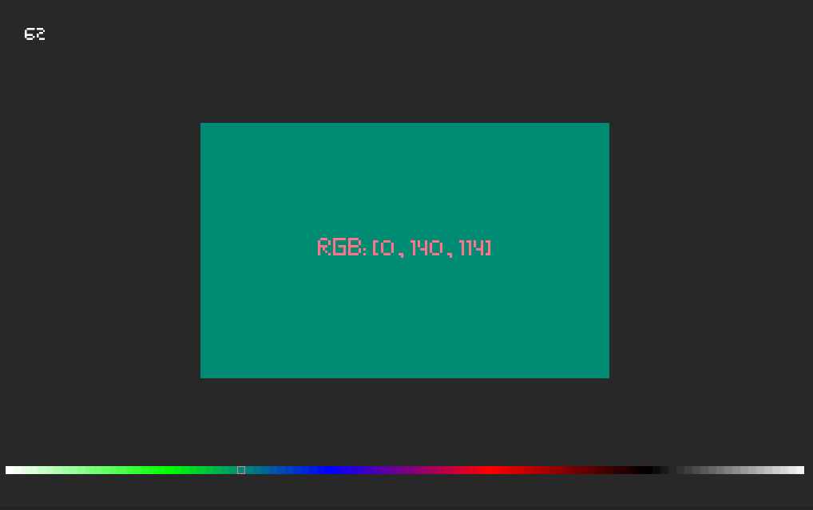
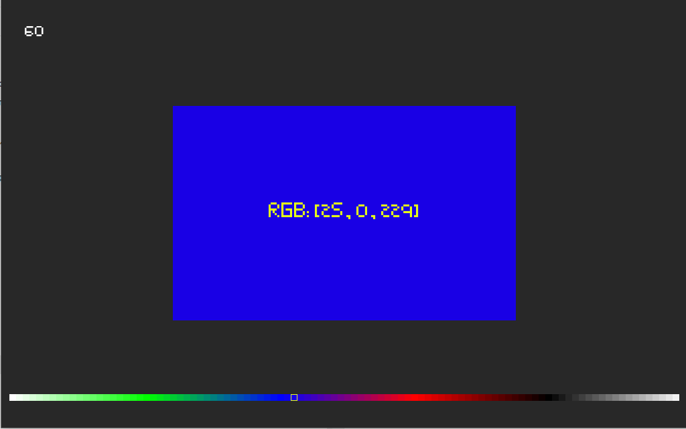
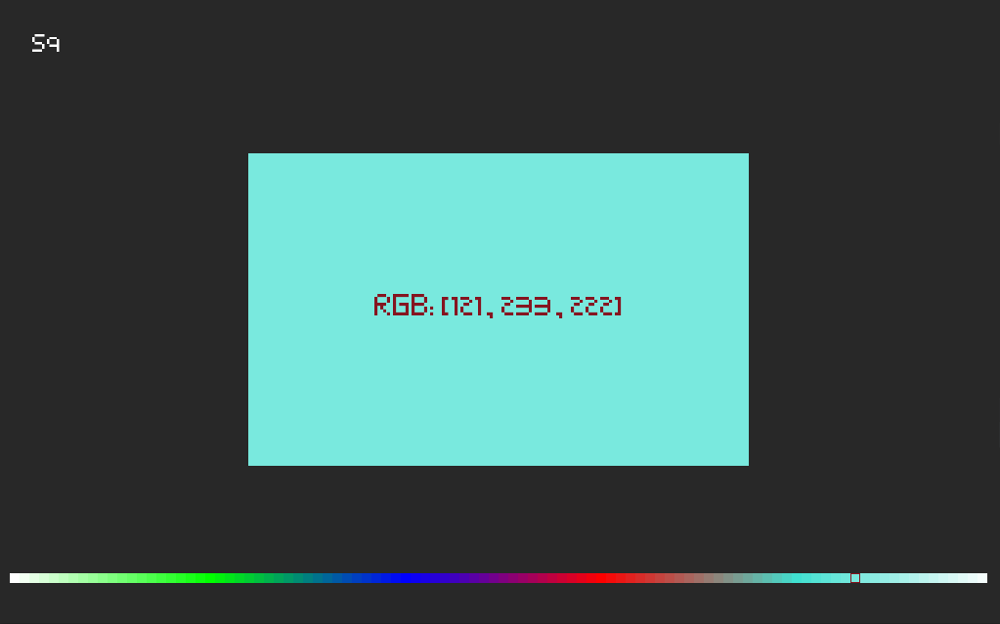

# A_Simple_Color_Gradient
### it generes a gradient between an unlimited number of colors 
    All fantional is encapsulated in this class (the coloros of which the gradient will be generated are passed first, then number to cells, and game class to access text drawing method )
    
self.color_grad = **Color_Gradient**((WHITE, GREEN, BLUE, RED, BLACK), 100, self)
    
    Also it is supposed to be updated and drawn in a loop
    
self.color_grad.update()
self.color_grad.draw(self.screen)
    

    
    A couple of examples:

